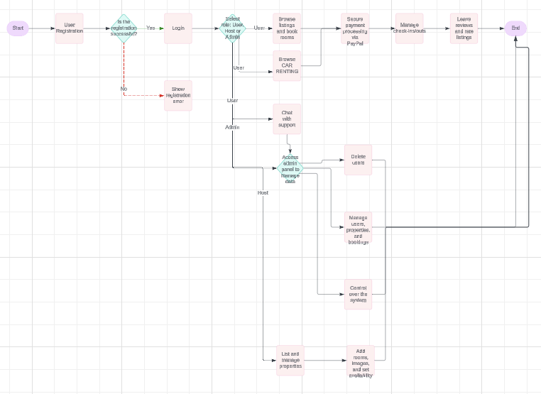
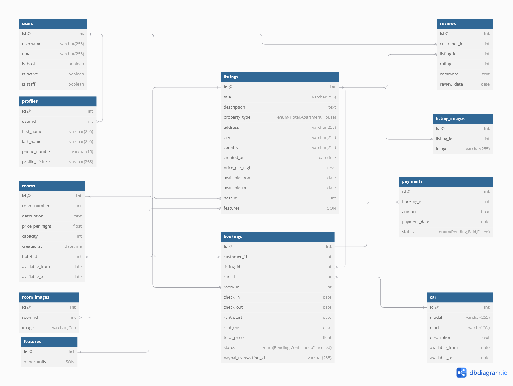

# Booking Management System 


## Description

This project is a Django-based booking platform inspired by popular services like Airbnb, Booking.com, and Agoda. It allows users to register and authenticate, manage property listings, book rooms, process payments, and leave reviews for properties. The platform offers full user, host, and admin functionalities, ensuring a smooth booking experience for all users.

## Functionality

### Current Features:
1. **Property Listings**: Users can browse available hotel listings, view rooms, and make reservations.
   - **Browse Hotels** button redirects users to the listings where they can filter and select rooms or hotels.
2. **User Profiles**: After logging in, users can manage their profiles, view their listings (for hosts), or make new bookings.
3. **Host Features**: Hosts have the ability to list properties, add rooms, and update or delete listings.
4. **Booking System**: Users can select dates and properties to make bookings. Each booking shows check-in/check-out information and the total price.
5. **User Authentication**: The platform allows users to log in, log out, and update their profiles. User roles include regular users (guests) and hosts.
6. **Payment Integration**: Supports PayPal payments for booking confirmation.

### Planned Future Features:
1. **Car Booking**: Integration of a car booking service alongside hotel reservations, allowing users to rent vehicles during their stay.
2. **Password Reset via Email**: Implementation of a password recovery feature through email, allowing users to reset their passwords if forgotten.
3. **Chat with Support**: Adding a live chat feature for direct communication with customer support, enabling real-time assistance for users with inquiries or issues.
4. **Enhanced Filters and Search**: Expanding the search functionality to include more filters for finding listings based on additional preferences like location, price range, property type, and more.
5. **Mobile App Integration**: Plans to develop a mobile app for iOS and Android, providing a seamless experience for users to book on the go.

   

## Installation

1. Clone the repository:

   ```bash
   git clone https://github.com/justkurama/django-group-project-2024
   cd django-group-project-2024
   ```

2. Create a virtual environment:

   ```bash
   python -m venv env
   ```

3. Activate the virtual environment:

   On Windows:
   ```bash
   .\env\Scripts\activate
   ```

   On macOS/Linux:
   ```bash
   source env/bin/activate
   ```

4. Install the dependencies:

   ```bash
   pip install -r requirements.txt
   ```

5. Apply the migrations to set up the database:

   ```bash
   python manage.py makemigrations
   python manage.py migrate
   ```

6. Create a superuser to access the admin panel:

   ```bash
   python manage.py createsuperuser
   ```

7. Run the development server:

   ```bash
   python manage.py runserver
   ```

## Database Schema



## Database Models

### User

The `User` model represents a user of the platform.

| Field       | Type       | Description                                   |
|-------------|------------|-----------------------------------------------|
| username    | string     | The username of the user                      |
| email       | string     | The email address of the user                 |
| is_host     | boolean    | Indicates if the user is a host               |
| is_active   | boolean    | Indicates if the user account is active       |
| is_staff    | boolean    | Indicates if the user has admin privileges    |

### Profile

The `Profile` model represents a user's profile.

| Field           | Type             | Description                                  |
|-----------------|------------------|----------------------------------------------|
| user            | OneToOne(User)    | A one-to-one relationship with the `User`    |
| first_name      | string           | The user's first name                        |
| last_name       | string           | The user's last name                         |
| phone_number    | string           | The user's phone number                      |
| profile_picture | ImageField       | The profile picture of the user              |

### Listing

The `Listing` model represents a property listing.

| Field            | Type            | Description                                  |
|------------------|-----------------|----------------------------------------------|
| title            | string          | The title of the listing                     |
| description      | text            | A detailed description of the property       |
| property_type    | string          | Type of property (Hotel, Apartment, House)   |
| address          | string          | The address of the property                  |
| city             | string          | The city where the property is located       |
| country          | string          | The country where the property is located    |
| created_at       | DateTime        | The date and time the listing was created    |
| price_per_night  | decimal         | The price per night for the property         |
| available_from   | Date            | The start date of availability               |
| available_to     | Date            | The end date of availability                 |
| host             | ForeignKey(User)| The host (user) who owns the property        |

### ListingImage

The `ListingImage` model represents images for a listing.

| Field   | Type               | Description                                 |
|---------|--------------------|---------------------------------------------|
| listing | ForeignKey(Listing) | The associated listing                      |
| image   | ImageField          | The image file                              |

### Room

The `Room` model represents a room within a listing.

| Field            | Type               | Description                                  |
|------------------|--------------------|----------------------------------------------|
| room_number      | string             | The room number                             |
| description      | text               | A detailed description of the room          |
| price_per_night  | decimal            | The price per night for the room            |
| capacity         | integer            | The capacity of the room                    |
| created_at       | DateTime           | The date and time the room was created      |
| hotel            | ForeignKey(Listing)| The associated listing (hotel or property)  |
| available_from   | Date               | The start date of availability              |
| available_to     | Date               | The end date of availability                |

### RoomImage

The `RoomImage` model represents images for a room.

| Field   | Type             | Description                                 |
|---------|------------------|---------------------------------------------|
| room    | ForeignKey(Room)  | The associated room                        |
| image   | ImageField        | The image file                             |

### Booking

The `Booking` model represents a booking made by a user.

| Field                 | Type               | Description                                  |
|-----------------------|--------------------|----------------------------------------------|
| customer              | ForeignKey(User)   | The customer who made the booking            |
| listing               | ForeignKey(Listing)| The associated listing for the booking       |
| room                  | ForeignKey(Room)   | The room booked (if applicable)              |
| check_in              | Date               | The check-in date                            |
| check_out             | Date               | The check-out date                           |
| total_price           | decimal            | The total price of the booking               |
| status                | string             | The status of the booking (Pending, Confirmed, Cancelled) |
| paypal_transaction_id | string             | The PayPal transaction ID for payment        |

### Payment

The `Payment` model represents a payment associated with a booking.

| Field       | Type             | Description                                  |
|-------------|------------------|----------------------------------------------|
| booking     | OneToOne(Booking) | The booking associated with the payment      |
| amount      | decimal          | The amount paid                              |
| payment_date| DateTime         | The date and time of the payment             |
| status      | string           | The payment status (Pending, Paid, Failed)   |

### Review

The `Review` model represents a review left by a customer for a listing.

| Field       | Type               | Description                                  |
|-------------|--------------------|----------------------------------------------|
| customer    | ForeignKey(User)    | The customer who wrote the review            |
| listing     | ForeignKey(Listing) | The listing being reviewed                   |
| rating      | integer            | The rating given by the customer (1-5 stars) |
| comment     | text               | The comment left by the customer             |
| review_date | DateTime           | The date and time the review was created     |

---

## Relationships

- **User**: Users can be either hosts or customers. Hosts manage listings, and customers can make bookings.
- **Listing**: Each listing is associated with a host, and it can have multiple reviews and bookings.
- **Booking**: A booking is associated with a customer and a listing (or room).
- **Payment**: Each payment is linked to a booking.
- **Review**: A review is linked to both the customer and the listing.

## Endpoints

### General Endpoints

| Endpoint             | Method | Description                           |
|----------------------|--------|---------------------------------------|
| `/admin/`            | GET    | Admin dashboard                       |
| `/`                  | GET    | Home page                             |
| `/about/`            | GET    | About page                            |

### User Endpoints

| Endpoint                    | Method | Description                                 |
|-----------------------------|--------|---------------------------------------------|
| `/users/register/`           | POST   | Registers a new user                        |
| `/users/update/`             | POST   | Updates user details                        |
| `/users/delete/`             | POST   | Deletes a user account                      |
| `/users/profile/`            | GET    | Retrieves the current user’s profile        |
| `/users/<int:user_id>/`      | GET    | Retrieves details of a specific user        |
| `/users/login/`              | POST   | Logs in a user                              |
| `/users/logout/`             | POST   | Logs out the current user                   |
| `/users/password/`           | POST   | Changes the user’s password                 |

### Listing Endpoints

| Endpoint                               | Method | Description                                       |
|----------------------------------------|--------|---------------------------------------------------|
| `/listings/create/`                    | POST   | Creates a new property listing                    |
| `/listings/success/`                   | GET    | Shows success message after listing creation      |
| `/listings/`                           | GET    | Retrieves a list of all property listings         |
| `/listings/<int:id>/`                  | GET    | Retrieves details of a specific property listing  |
| `/listings/<int:id>/update/`           | POST   | Updates details of a specific property listing    |
| `/listings/<int:id>/delete/`           | POST   | Deletes a specific property listing               |
| `/listings/rooms/`                     | GET    | Retrieves a list of all rooms                     |
| `/listings/create_room/`               | POST   | Creates a new room in a property                  |
| `/listings/rooms/<int:id>/`            | GET    | Retrieves details of a specific room              |
| `/listings/rooms/<int:id>/update/`     | POST   | Updates details of a specific room                |
| `/listings/rooms/<int:id>/delete/`     | POST   | Deletes a specific room                           |

### Booking Endpoints

| Endpoint                                                 | Method | Description                                         |
|----------------------------------------------------------|--------|-----------------------------------------------------|
| `/bookings/create/<int:listing_id>/<int:room_id>/`        | POST   | Creates a new booking for a specific listing and room|
| `/bookings/<int:booking_id>/`                            | GET    | Retrieves details of a specific booking             |
| `/bookings/list/`                                        | GET    | Retrieves a list of all bookings                    |
| `/bookings/payments/<int:booking_id>/create/`            | POST   | Initiates payment for a specific booking            |
| `/bookings/payments/<int:booking_id>/<int:payment_id>/success/`| GET | Shows payment success for a specific booking        |
| `/bookings/payments/<int:booking_id>/cancel/`            | GET    | Cancels the payment for a specific booking          |

---

## Technologies Used

- **Backend**: Django
- **Frontend**: HTML, CSS
- **Payment Integration**: PayPal

## About the Team
- **Team Name**: `StepUp`
- **Class**: `Fri_10AM`
- **Team Members**:
  - *Kordabay Nursat* (ID: `22B030486`, Telegram: @n_kordabay) 
  - *Zholdybay Altynbek* (ID: `22B030543`, Telegram: @z_altynbek_q) 
  - *Tolebayev Kuramanbek* (ID: `22B030597`, Telegram: @justkurama) 

## Contributing
Contributions are welcome!


1. Fork the repository.
2. Create a new branch (`git checkout -b feature-branch`).
3. Make your changes.
4. Commit the changes (`git commit -m 'Add feature'`).
5. Push to the branch (`git push origin feature-branch`).
6. Open a pull request.
